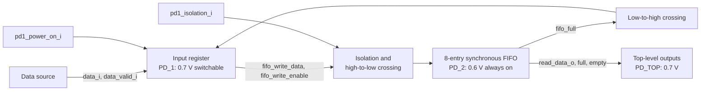
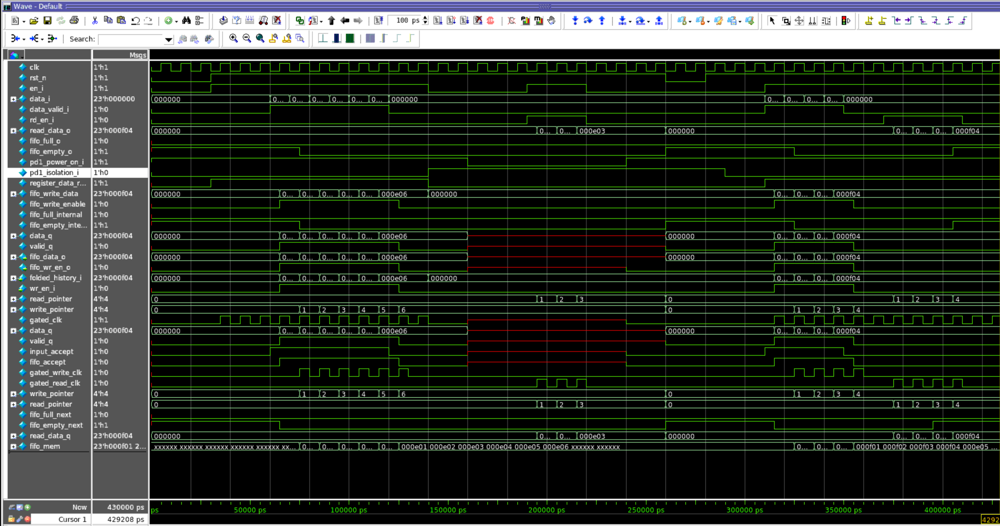
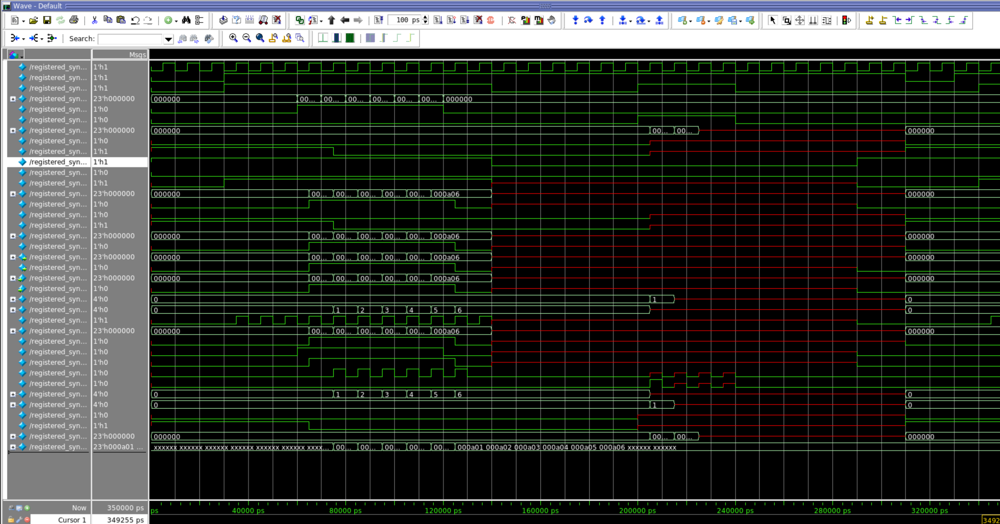

# Power Aware Registered Synchronous FIFO

This project implements and verifies a synchronous FIFO preceded by a one-entry input register. The design is partitioned into two voltage domains with clock gating, a switchable register domain, an always-on FIFO domain, level shifter intent, and isolation intent described in UPF 2.1.

The repository follows the design from RTL and UVM verification through Questa Power Aware simulation, Design Compiler synthesis, SAIF activity generation, and PrimeTime power analysis.

## Design summary

| Item | Configuration |
|---|---|
| Input data width | 23 bits |
| FIFO depth | 8 entries |
| FIFO type | Single-clock synchronous FIFO |
| Input stage | One-entry valid/data register |
| Clock control | Latch-based integrated clock-gate model |
| Register domain | `PD_1`, switchable, 0.7 V |
| FIFO domain | `PD_2`, always on, 0.6 V |
| Top domain | `PD_TOP`, always on, 0.7 V |
| Power intent | UPF 2.1 |
| Verification | UVM scoreboard and directed sequences |

## Architecture



The input register accepts data only when it has space or when its current value transfers into the FIFO. Its internal handshake is:

```systemverilog
fifo_accept  = en_i && valid_q && !fifo_full_i;
data_ready_o = en_i && (!valid_q || fifo_accept);
input_accept = data_valid_i && data_ready_o;
```

When `input_accept` and `fifo_accept` are both asserted, the old registered word enters the FIFO while the new input replaces it. When no new valid input arrives after a transfer, `valid_q` clears so the previous word cannot be written repeatedly.

## RTL blocks

- `gated_clk`: latches its enable while the source clock is low and ANDs that value with the clock.
- `fifo_input_register`: buffers one valid input and applies backpressure from the FIFO full flag.
- `sync_fifo`: stores eight 23-bit values, supports reads and writes, and maintains full and empty flags with wrap-bit pointers.
- `registered_sync_fifo`: connects the input register and FIFO and forms the UPF hierarchy.

Only the FIFO data output, full flag, and empty flag leave the wrapper. `data_ready_o` remains an internal register-to-source control observation, and no separate read-valid output is used.

## Power architecture

The UPF defines three domains:

| Domain | Instance extent | Supply | Behavior |
|---|---|---|---|
| `PD_TOP` | Wrapper | 0.7 V | Always on |
| `PD_1` | `u_input_register` | 0.7 V switched supply | On or off |
| `PD_2` | `u_fifo` | 0.6 V | Always on |

`PS_PD1` creates `VDD_PD1_n` from `VDD_0P7_n`. When `pd1_power_on_i` is low, `PD_1` enters the `PD1_OFF` power state and its nonretained state is corrupted in power-aware simulation.

The UPF adds these crossing strategies:

- High-to-low level shifting from `PD_1` and `PD_TOP` into `PD_2`.
- Low-to-high level shifting from `PD_2` into `PD_1` and `PD_TOP`.
- Clamp-to-zero isolation from switchable `PD_1` into `PD_2` and `PD_TOP`.
- Active-high isolation controlled by `pd1_isolation_i` and powered from the always-on top supply.

The legal shutdown order used by the testbench is:

1. Assert isolation.
2. Switch `PD_1` off.
3. Keep the FIFO operational while the register domain is off.
4. Restore `PD_1` power while isolation remains asserted.
5. Reset the nonretained input register.
6. Release isolation.

Detailed UPF notes are available in [registered_sync_fifo_upf_design_notes.pdf](docs/registered_sync_fifo_upf_design_notes.pdf).

## Verification

The UVM environment contains a sequence item, reusable base sequence, sequencer, driver, monitor, reference-model scoreboard, agent, environment, and test.

The available directed sequences cover:

- Basic register-to-FIFO writes and reads.
- FIFO full and empty transitions.
- Simultaneous reads and writes.
- Wrapper enable and clock-gating behavior.
- Gaps in valid input traffic.
- Recovery from a full FIFO with a value pending in the input register.
- Legal PD1 isolation, shutdown, restore, reset, and release.
- A negative shutdown test with isolation disabled.
- A combined activity workload used to generate SAIF for power estimation.

The scoreboard models both the one-entry input register and the eight-entry FIFO. It checks output data ordering, full and empty flags, accepted and rejected inputs, writes, reads, and outstanding data. The completed power-aware run reported no scoreboard errors.

The saved [Questa Power Aware static-check report](docs/reports/questa_pa_static_checks.rpt) reports 25 valid level shifters and 25 valid isolation cells for the analyzed crossings.

## Power-aware simulation results

### Isolation enabled



During the shutdown window, the internal state of `u_input_register` becomes unknown because `PD_1` is off. Isolation clamps the signals entering the always-on FIFO, so the FIFO pointers, flags, and stored values remain usable. Existing FIFO contents can still be read while the register domain is off.

### Isolation disabled



This negative test switches `PD_1` off without asserting isolation. Unknown register-domain values cross into `PD_2`, causing visible corruption of FIFO-side control and state. The comparison demonstrates why the isolation strategy is required.

Unknown values in unwritten FIFO memory locations are expected because the memory array is not reset. The scoreboard only compares entries that have been written and accepted.

## Running the project

### Questa Power Aware simulation

From the repository root:

```tcl
do scripts/run_registered_sync_fifo.do
```

The script compiles the RTL and UVM testbench, applies the UPF, runs the combined power activity sequence, and writes:

```text
reports/saif/registered_sync_fifo.saif
```

Copy the SAIF into `saif/` before the PrimeTime run.

### Design Compiler

The ASAP7 `.db` files listed in [lib/README.md](lib/README.md) must be placed in `lib/asap7_db/`.

```bash
mkdir -p logs
set -o pipefail
dc_shell -f scripts/synthesize_registered_sync_fifo.tcl 2>&1 | tee logs/dc_registered_sync_fifo.log
```

Design Compiler generates the gate-level netlist, SDC, DDC, and saved UPF in `netlist/` and writes synthesis reports into `reports/synthesis/`.

### PrimeTime

```bash
set -o pipefail
pt_shell -f scripts/primetime_registered_sync_fifo.tcl 2>&1 | tee logs/pt_registered_sync_fifo.log
```

PrimeTime is configured to report timing checks, setup and hold paths, switching activity, analysis coverage, multi-voltage checks, and averaged power.

## Tool and characterization limits

The available ASAP7 database set is characterized only at `PVT_0P7V_25C`. UPF still describes `PD_2` at 0.6 V and enables architectural power-aware checks, but these libraries do not provide a characterized 0.6 V timing and power corner. Final 0.6 V numbers and physical level-shifter power require suitable 0.6 V and multi-voltage library views.

A previous FIFO-only reference run at the available 0.7 V library corner reported:

| Component | Power |
|---|---:|
| Cell internal | 13.53 µW |
| Net switching | 4.927 µW |
| Leakage | 0.07626 µW |
| Total | 18.54 µW |

These values are a reference for the FIFO alone and are not the final registered-wrapper result.

## Current status

- RTL and wrapper behavior defined.
- UVM directed and power-aware activity sequences implemented.
- Positive isolation and negative no-isolation simulations captured.
- SAIF generation flow prepared.
- Design Compiler synthesis completed.
- PrimeTime wrapper power run is currently blocked while reading the generated Verilog netlist.

PrimeTime reports `SVR-15` because one unresolved generated cell type uses scalar `DATA1`, `DATA2`, and `Z` ports in some instances and 23-bit ports in others. The failure occurs during `read_verilog`, before SAIF is read, so it is unrelated to unknown values in the testbench activity. The next debug step is to inspect netlist lines 125–165 and determine whether the unresolved object is a generic isolation or level-shifter implementation that the ASAP7 libraries cannot map.

## Repository layout

```text
registered-sync-fifo-low-power/
├── constraints/    Timing constraints
├── docs/           UPF notes and waveform evidence
├── lib/            Instructions for external ASAP7 databases
├── netlist/        Generated Design Compiler outputs
├── reports/        Generated synthesis and PrimeTime reports
├── rtl/            Synthesizable SystemVerilog
├── saif/           Generated switching activity input
├── scripts/        Questa, Design Compiler, and PrimeTime flows
├── tb/             UVM testbench and sequences
└── upf/            UPF 2.1 power intent
```

## Planned work

- Resolve the generated netlist port-width mismatch in PrimeTime.
- Complete wrapper-level timing and SAIF-annotated power reports.
- Add characterized multi-voltage level-shifter and isolation cells when suitable library views are available.
- Evaluate retention for the FIFO memory as a separate design option.
